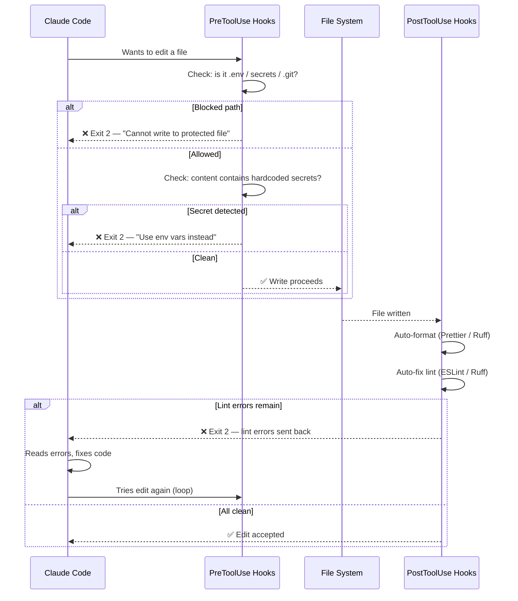
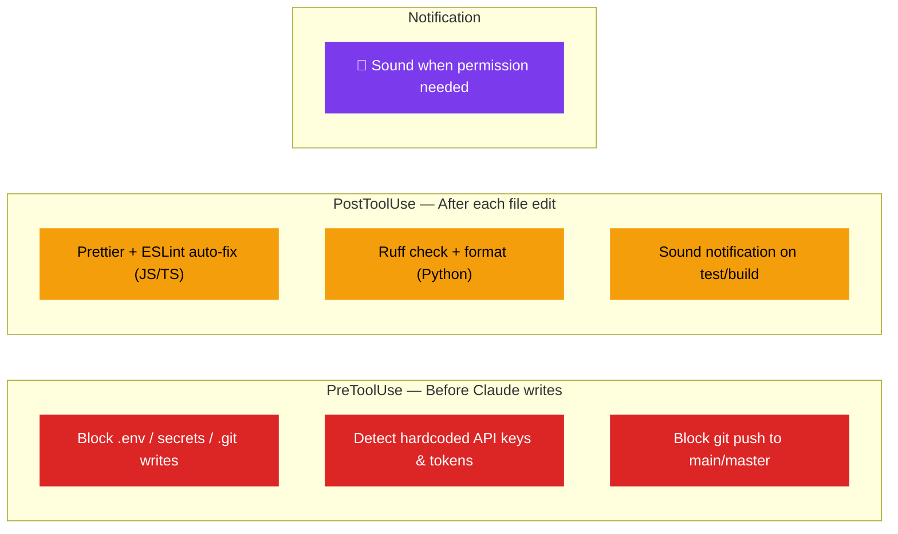

# Claude Code Bootstrap

[](LICENSE)
[](CODE_OF_CONDUCT.md)
[](CONTRIBUTING.md)

A single bash script that scaffolds [Claude Code](https://docs.anthropic.com/en/docs/claude-code) best practices and can also scaffold Gemini/Codex project help entrypoints for multi-agent setups.

Based on the patterns from *The Definitive Guide to Automated Development Workflows with Claude Code*.

> 📖 **New to Claude Code Bootstrap?** Start with the **[User Guide](USER_GUIDE.md)** for a complete walkthrough of agents, invocation methods, the quality pipeline, and best practices.

## What it does


```mermaid
graph TD
    A["./claude-code-bootstrap.sh"] --> B["CLAUDE.md Files"]
    A --> C["Path-Scoped Rules"]
    A --> D["Task Agents"]
    A --> F["Hooks"]
    A --> G["MCP Servers"]
    A --> H["Install Tooling"]

    B --> B1["Root — tech stack, structure, commands, rules"]
    B --> B2["frontend/ — component, state, styling conventions"]
    B --> B3["backend/ — API, DB, security conventions"]

    C --> C1["security.md — SQL injection, XSS, auth rules"]
    C --> C2["frontend/components.md — shadcn/ui, lucide, cn()"]
    C --> C3["frontend/animations.md — motion.dev conventions"]
    C --> C4["backend/api.md — async, Depends, Pydantic"]
    C --> C5["backend/database.md — SQLAlchemy 2.0, Alembic"]

    D --> D0["BMAD Planning: analyst → pm → architect → scrum-master"]
    D --> D1["ship — stage, commit, push, open PR (Sonnet)"]
    D --> D2["ui-review — UX, a11y, responsive checks (Sonnet)"]
    D --> D3["qa — tests, coverage, E2E validation (Sonnet)"]
    D --> D4["code-reviewer — quality gate (Sonnet)"]
    D --> D5["security-reviewer — SAST scan (Haiku)"]

    F --> F1["PreToolUse — block secrets, protect main branch"]
    F --> F2["PostToolUse — auto-format + lint every edit"]
    F --> F3["Notification — audio alerts"]

    G --> G1["Playwright MCP — browser verification"]
    G --> G2["PostgreSQL MCP — schema-aware queries"]
    G --> G3["Context7 MCP — up-to-date library docs"]

    style A fill:#7c3aed,color:#fff,stroke:none
    style B fill:#2563eb,color:#fff,stroke:none
    style C fill:#2563eb,color:#fff,stroke:none
    style D fill:#2563eb,color:#fff,stroke:none
    style F fill:#2563eb,color:#fff,stroke:none
    style G fill:#2563eb,color:#fff,stroke:none
    style H fill:#2563eb,color:#fff,stroke:none
```

## BMAD Planning Agents

Bootstrap includes 4 planning agents that guide you from idea to implementation-ready stories:

```
analyst → pm → architect → scrum-master → start coding
```

| Agent | Model | Command | Output |
|-------|-------|---------|--------|
| **analyst** | Haiku | `claude --agent analyst` | `docs/briefs/product-brief.md` |
| **pm** | Haiku | `claude --agent pm` | `docs/prd.md` |
| **architect** | Sonnet | `claude --agent architect` | `docs/architecture.md` |
| **scrum-master** | Haiku | `claude --agent scrum-master` | `docs/stories/*.md` |

Each agent is dialogue-based (interview → draft → confirm → write) and checks for prerequisite files before running. None of them write code — they produce documentation only.

Use `/project-help` within Claude or Gemini sessions, and `$project-help` in Codex, to get help for the active product.

## How the hooks pipeline works

Every file edit passes through a deterministic quality pipeline. The key mechanism is **exit code 2** — it blocks Claude's action and feeds errors back, creating a self-correcting loop.


```mermaid
sequenceDiagram
    participant C as Claude Code
    participant Pre as PreToolUse Hooks
    participant FS as File System
    participant Post as PostToolUse Hooks

    C->>Pre: Wants to edit a file
    Pre->>Pre: Check: is it .env / secrets / .git?
    alt Blocked path
        Pre-->>C: ❌ Exit 2 — "Cannot write to protected file"
    else Allowed
        Pre->>Pre: Check: content contains hardcoded secrets?
        alt Secret detected
            Pre-->>C: ❌ Exit 2 — "Use env vars instead"
        else Clean
            Pre-->>FS: ✅ Write proceeds
        end
    end

    FS-->>Post: File written
    Post->>Post: Auto-format (Prettier / Ruff)
    Post->>Post: Auto-fix lint (ESLint / Ruff)
    alt Lint errors remain
        Post-->>C: ❌ Exit 2 — lint errors sent back
        C->>C: Reads errors, fixes code
        C->>Pre: Tries edit again (loop)
    else All clean
        Post-->>C: ✅ Edit accepted
    end
```

## Directory structure created (Claude platform)

```
your-project/
├── CLAUDE.md                              # Root project context (<150 lines)
├── .mcp.json                              # Playwright + Postgres + Context7
├── .claude/
│   ├── settings.json                      # Hooks wiring + permission denylists
│   ├── rules/
│   │   ├── security.md                    # SQL injection, XSS, auth, deps
│   │   ├── frontend/
│   │   │   ├── components.md              # shadcn/ui, lucide, cn() patterns
│   │   │   └── animations.md              # motion.dev conventions
│   │   └── backend/
│   │       ├── api.md                     # async, Depends(), Pydantic models
│   │       └── database.md                # SQLAlchemy 2.0, Alembic migrations
│   ├── agents/
│   │   ├── analyst.md                     # BMAD: product discovery (Haiku)
│   │   ├── pm.md                          # BMAD: PRD from brief (Haiku)
│   │   ├── architect.md                   # BMAD: technical design (Sonnet)
│   │   ├── scrum-master.md                # BMAD: stories from PRD (Haiku)
│   │   ├── code-reviewer.md               # Quality gate — invoke manually (Sonnet)
│   │   ├── security-reviewer.md           # Security scan — invoke manually (Haiku)
│   │   ├── ship.md                        # Git commit, push, PR (Sonnet)
│   │   ├── ui-review.md                   # UX, a11y, responsive review (Sonnet)
│   │   └── qa.md                          # Tests, coverage, E2E (Sonnet)
│   ├── commands/
│   │   └── project-help.md                # /project-help slash command
│   └── hooks/
│       ├── end-of-turn-check.sh           # Full project tsc + eslint + ruff
│       ├── detect-secrets.sh              # AWS/Stripe/GitHub token patterns
│       └── build-notify.sh                # macOS sounds on test/build results
├── docs/
│   └── README.md                          # BMAD workflow guide
├── frontend/
│   └── CLAUDE.md                          # Frontend-specific conventions
└── backend/
    └── CLAUDE.md                          # Backend-specific conventions
```

When `--agent-platform` includes other providers, these are also created:

```text
your-project/
├── GEMINI.md                              # Gemini project context
├── .gemini/commands/project-help.toml     # Gemini /project-help command
├── AGENTS.md                              # Codex project instructions
├── .agents/skills/project-help/SKILL.md   # Codex $project-help skill
└── docs/help/{claude,gemini,codex}.md     # Provider-specific help docs
```

## Usage

```bash
# Auto-detect stack and bootstrap current directory
./claude-code-bootstrap.sh

# Explicit stack type
./claude-code-bootstrap.sh --stack fullstack ./my-project
./claude-code-bootstrap.sh --stack frontend ./my-nextjs-app
./claude-code-bootstrap.sh --stack backend ./my-api
./claude-code-bootstrap.sh --stack generic ./my-cli-tool

# Select agent platform(s)
./claude-code-bootstrap.sh --agent-platform claude
./claude-code-bootstrap.sh --agent-platform codex
./claude-code-bootstrap.sh --agent-platform claude,codex
./claude-code-bootstrap.sh --agent-platform gemini --enable-experimental-subagents

# Custom database name and port (fullstack/backend only)
./claude-code-bootstrap.sh -d production_db -p 5433

# Preview what would be created (no writes)
./claude-code-bootstrap.sh --dry-run

# Config files only, skip npm/pip installs
./claude-code-bootstrap.sh --skip-install
```

### Options

| Flag | Description | Default |
|------|-------------|---------|
| `--stack` | Project type: `fullstack`, `frontend`, `backend`, `generic`, `auto` | `auto` |
| `--agent-platform` | Target platform(s): `claude`, `gemini`, `codex`, `auto` (comma-separated supported) | `claude` |
| `--enable-experimental-subagents` | Enables Gemini subagent scaffolding (`.gemini/agents/`) | `false` |
| `-d, --db-name` | PostgreSQL database name for MCP config | `myapp` |
| `-p, --db-port` | PostgreSQL port for MCP config | `5432` |
| `-s, --skip-install` | Skip installing npm/pip dependencies | `false` |
| `-n, --dry-run` | Show what would be created, don't write | `false` |
| `-h, --help` | Show help | — |

### Stack types

| Stack | What gets created |
|-------|-------------------|
| **fullstack** | Everything: frontend + backend rules, all 5 agents, Playwright + PostgreSQL + Context7 MCP |
| **frontend** | Frontend CLAUDE.md + rules, ui-review agent, Playwright MCP, ESLint/Prettier hooks |
| **backend** | Backend CLAUDE.md + rules, PostgreSQL MCP, Ruff hooks |
| **generic** | Root CLAUDE.md (with TODOs), security rules, ship + qa agents, auto agents, secrets hooks, Context7 MCP |
| **auto** | Detects from project files (`package.json`, `pyproject.toml`, etc.) — falls back to `generic` |

### Agent platforms

| Platform | What gets scaffolded | Notes |
|----------|----------------------|-------|
| `claude` | `CLAUDE.md`, `.claude/agents`, `.claude/commands/project-help.md`, hooks, rules | Full BMAD + quality-gate scaffolding |
| `gemini` | `GEMINI.md`, `.gemini/commands/project-help.toml` | Subagents are optional and experimental |
| `codex` | `AGENTS.md`, `.agents/skills/project-help/SKILL.md` | Uses skill-based project help |

## What gets installed

When running without `--skip-install`, the script installs:

**Frontend** (via pnpm/npm):
eslint, prettier, eslint-config-next, @typescript-eslint/eslint-plugin, @typescript-eslint/parser, eslint-plugin-react-hooks

**Backend** (via pip/uv):
ruff, bandit, pip-audit, pre-commit

**Browser** (via npx):
Playwright Chromium (for MCP browser verification + E2E tests)

## Workflow

```
Plan (BMAD agents) → Develop → code-reviewer / security-reviewer → qa agent → ship agent
```

### User-invoked Agents

| Agent | Model | CLI (new terminal) | In-session (natural language) | What it does |
|-------|-------|-------------------|-------------------------------|-------------|
| **code-reviewer** | Sonnet | `claude --agent code-reviewer` | `Have the code-reviewer look at my recent changes` | Reviews quality, OWASP Top 10, N+1 queries, naming. Blocks on critical issues. |
| **security-reviewer** | Haiku | `claude --agent security-reviewer` | `Run the security-reviewer agent` | Runs Bandit SAST, dependency audit, secret scanning, data flow analysis. |
| **ship** | Sonnet | `claude --agent ship` | `Use the ship agent to open a PR` | Verify branch, stage changes, conventional commit, push, create PR via `gh` |
| **ui-review** | Sonnet | `claude --agent ui-review` | `Have the ui-review agent check my changes` | Component architecture, a11y, responsive design, motion.dev, Tailwind, Playwright screenshots |
| **qa** | Sonnet | `claude --agent qa` | `Use the qa agent to check test coverage` | Run tests, analyze coverage, generate missing tests, E2E via Playwright, report blockers |

All agents run as **subagents on Sonnet/Haiku**, keeping Opus reserved for the main coding session. Each agent prints an identification banner showing its name and model on startup.

**Two invocation methods:**
- **CLI** (`claude --agent <name>`) — starts a *new* session dedicated to that agent
- **In-session** — ask Claude naturally within your coding session; it delegates to the subagent via the Task tool, keeping your main context intact

## Hooks explained


```mermaid
graph LR
    subgraph "PreToolUse — Before Claude writes"
        P1["Block .env / secrets / .git writes"]
        P2["Detect hardcoded API keys & tokens"]
        P3["Block git push to main/master"]
    end

    subgraph "PostToolUse — After each file edit"
        Q1["Prettier + ESLint auto-fix (JS/TS)"]
        Q2["Ruff check + format (Python)"]
        Q3["Sound notification on test/build"]
    end

    subgraph "Notification"
        N1["🔔 Sound when permission needed"]
    end

    style P1 fill:#dc2626,color:#fff,stroke:none
    style P2 fill:#dc2626,color:#fff,stroke:none
    style P3 fill:#dc2626,color:#fff,stroke:none
    style Q1 fill:#f59e0b,color:#000,stroke:none
    style Q2 fill:#f59e0b,color:#000,stroke:none
    style Q3 fill:#f59e0b,color:#000,stroke:none
    style N1 fill:#7c3aed,color:#fff,stroke:none
```

The self-correcting loop: when any hook returns **exit code 2**, Claude sees the error output and automatically fixes the issue before retrying. This means Claude cannot finish a turn with lint errors or security violations.

> **Manual lint check:** The `end-of-turn-check.sh` script is available for on-demand use: `bash .claude/hooks/end-of-turn-check.sh`

## MCP servers

During setup, the script prompts you to select which MCP servers to include. Defaults are based on your stack type.

| Server | Default on | Purpose |
|--------|-----------|---------|
| **Playwright** | frontend, fullstack | Browser automation — screenshots, E2E testing, visual verification |
| **PostgreSQL** | backend, fullstack | Schema-aware DB queries — reads real table structures for models/migrations |
| **Context7** | all stacks | Up-to-date library docs — replaces stale training data with current API docs |
| **AWS Knowledge Base** | opt-in | Search AWS Bedrock knowledge bases via RAG for domain-specific documentation |

You can always edit `.mcp.json` later to add/remove servers.

## User Guide

> 📖 **[Read the full User Guide →](USER_GUIDE.md)** for comprehensive documentation including workflows, context management, troubleshooting, and FAQ.

Below is a quick reference. For detailed explanations, see the full guide.

### Getting started

After bootstrapping, start Claude Code in your project:

```bash
cd your-project
claude
```

PostToolUse hooks auto-format and lint every file edit. Use `/project-help` for a full list of agents and commands.

### Invoking task agents

Task agents can be launched two ways:

**From a separate terminal** (recommended — doesn't interrupt your coding session):
```bash
claude --agent ship
claude --agent qa
claude --agent ui-review
claude --agent code-reviewer
claude --agent security-reviewer
```

**From within a Claude session** (ask Claude to delegate):
```
> run the qa agent to check test coverage
> use the ship agent to open a PR
```

| Agent | When to use | What happens |
|-------|-------------|--------------|
| `ship` | Ready to commit and open a PR | Creates feature branch, stages files, conventional commit, pushes, opens PR via `gh` |
| `qa` | Before shipping, to verify quality | Runs pytest/vitest, checks coverage, generates missing tests, runs E2E |
| `ui-review` | After frontend changes | Reviews a11y, responsive design, shadcn/ui patterns, animation conventions |
| `code-reviewer` | After code changes, before shipping | Reviews quality, OWASP Top 10, N+1 queries, naming conventions |
| `security-reviewer` | After code changes, before shipping | Runs SAST, dependency audit, secret scanning |

All task agents run on **Sonnet** regardless of your main model setting.

### Typical development session

**Option A: Multi-terminal workflow**
```bash
# Terminal 1: main coding session (Opus)
claude
> Implement user profile page with avatar upload
  ... Claude codes, auto-review runs at end of turn ...
  ... if critical issues found, Claude auto-fixes ...

# Terminal 2: review & ship (Sonnet)
claude --agent ui-review    # reviews a11y, responsive, component patterns
claude --agent qa            # runs tests, generates missing coverage
claude --agent ship          # creates branch, commits, pushes, opens PR
  # → PR: https://github.com/you/repo/pull/42
```

**Option B: Single-session workflow (in-session delegation)**
```
> Implement user profile page with avatar upload
  ... Claude codes, auto-review runs at end of turn ...
> Use the qa agent to run tests and check coverage
  ═══════════════════════════════════════════
  🧪 QA AGENT (model: sonnet)
  ═══════════════════════════════════════════
  ... subagent runs tests, returns summary ...
> Use the ship agent to commit and open a PR
  ═══════════════════════════════════════════
  🚀 SHIP AGENT (model: sonnet)
  ═══════════════════════════════════════════
  ... subagent commits, pushes, opens PR ...
```

In-session delegation runs the agent as a **subagent** — it gets its own context window, uses the model specified in its config, and returns a summary to your main session.

> **Code review and security scanning** are available as user-invoked agents (`claude --agent code-reviewer` / `claude --agent security-reviewer`). Run them when you want a thorough review, before shipping.
>
> **Manual lint check:** Run `bash .claude/hooks/end-of-turn-check.sh` for a full project lint/type-check.

### Model allocation

| Role | Model | Why |
|------|-------|-----|
| **Main coding agent** | Opus (your CLI default) | Complex reasoning, architecture decisions, code generation |
| **Code reviewer** (on demand) | Sonnet | Good enough for pattern matching and best-practice checks |
| **Security reviewer** (on demand) | Haiku | Fast SAST scanning and regex matching |
| **ship, qa, ui-review** (on demand) | Sonnet | Executes workflows with tool access, doesn't need Opus-level reasoning |

Only the main coding agent uses Opus. All other agents run as subagents on cheaper models — this is enforced by the `model:` field in each agent's frontmatter.

### Overriding agent models

To change a model, edit the frontmatter in the agent/skill file:

```yaml
# .claude/agents/code-reviewer.md
---
model: sonnet    # change to "haiku" or "opus" as needed
---
```

## Uninstall

Remove all files created by the bootstrap script:

```bash
# Preview what would be removed
./claude-code-bootstrap.sh --uninstall --dry-run ./my-project

# Remove everything (with confirmation prompt)
./claude-code-bootstrap.sh --uninstall ./my-project
```

This removes generated files (`CLAUDE.md`, `.claude/`, `GEMINI.md`, `.gemini/`, `AGENTS.md`, `.agents/`, `.mcp.json`) and cleans up empty directories. It does **not** uninstall packages (eslint, ruff, bandit, etc.) — remove those manually if needed.

## Customization

After running the script, you should:

1. **Edit provider context files** — `CLAUDE.md`, `GEMINI.md`, and/or `AGENTS.md` based on selected platforms.
2. **Review provider help entrypoints** — `.claude/commands/project-help.md`, `.gemini/commands/project-help.toml`, `.agents/skills/project-help/SKILL.md`.
3. **Review `.claude/settings.json`** — Adjust hook commands if Claude hooks are enabled for your stack.
4. **Add GitHub MCP** — Add your GitHub PAT to `.mcp.json` if you want PR/issue integration.
5. **Add personal overrides** — `.claude/settings.local.json`, `.gemini/settings.local.json`, `AGENTS.local.md` are gitignored.

## Community

- **Contributing**: See [CONTRIBUTING.md](CONTRIBUTING.md) for how to get started.
- **Code of Conduct**: We follow the [Contributor Covenant](CODE_OF_CONDUCT.md).
- **Security**: Please report vulnerabilities privately. See [SECURITY.md](SECURITY.md).
- **License**: Released under the [MIT License](LICENSE).

## References

- [Claude Code Documentation](https://docs.anthropic.com/en/docs/claude-code)
- [Claude Code Hooks](https://docs.anthropic.com/en/docs/claude-code/hooks)
- [Gemini CLI Custom Commands](https://geminicli.com/docs/cli/custom-commands/)
- [OpenAI Codex Skills](https://developers.openai.com/codex/skills)
- [Agent Skills Open Standard](https://agentskills.io)
- [Anthropic Skills Repository](https://github.com/anthropics/skills)
- [Playwright MCP](https://github.com/microsoft/playwright-mcp)
